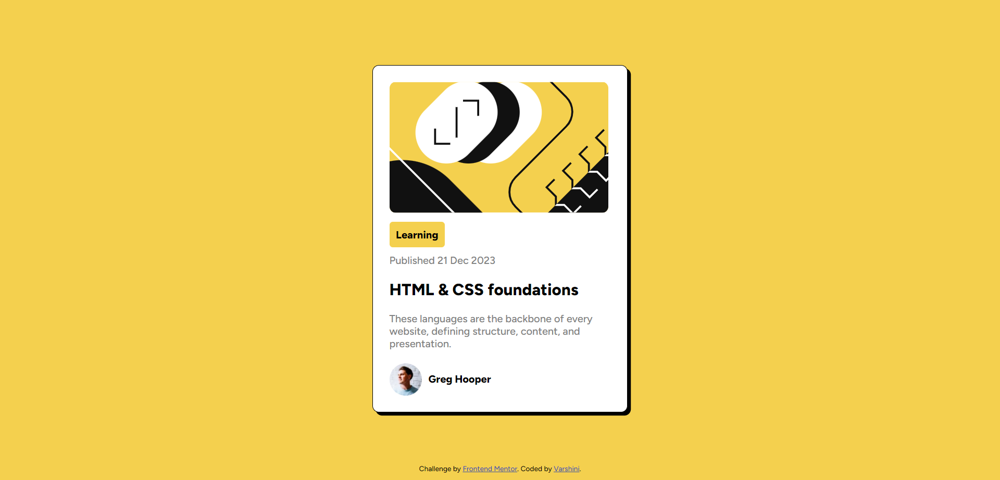

# Frontend Mentor - Blog preview card solution

This is a solution to the [Blog preview card challenge on Frontend Mentor](https://www.frontendmentor.io/challenges/blog-preview-card-ckPaj01IcS). Frontend Mentor challenges help you improve your coding skills by building realistic projects. 

## Table of contents

- [Overview](#overview)
  - [The challenge](#the-challenge)
  - [Screenshot](#screenshot)
  - [Links](#links)
- [My process](#my-process)
  - [Built with](#built-with)
  - [What I learned](#what-i-learned)
  - [Continued development](#continued-development)

## Overview

This project is a blog preview card component challenge from Frontend Mentor. The goal was to build a responsive card component using HTML and CSS, displaying a blog preview with an image, title, description, and author information.

### The challenge

Users should be able to:
- Ensure compatibility across different screen sizes and devices
- See hover and focus states for all interactive elements on the page

### Screenshot



### Links

- Solution URL: [Add solution URL here](https://github.com/varshini-0506/frontend-mentor-blog-preview.git)
- Live Site URL: [Add live site URL here]( https://varshini-0506.github.io/frontend-mentor-blog-preview/)

## My process

- Setup: Initialized the project with basic HTML and CSS files.
- HTML Structure: Created the structure of the card using semantic HTML elements.
- Styling: Applied CSS to style the card, including layout, typography, colors, and spacing. Used CSS Flexbox to achieve a responsive   design.
- Testing: Tested the component across various screen sizes to ensure responsiveness and made adjustments as needed.

### Built with

- Semantic HTML5 markup
- CSS custom properties
- Flexbox

### What I learned

```html
<div class="account">
  
  <div> Greg Hooper</div>
</div>
```
```css
.topic:hover{
   color:hsl(47, 88%, 63%) ;
   cursor: url(assets/black-hand-pointing-up.png),pointer;
}

```
### Continued development

- Animations: Add subtle hover effects and animations to enhance user interaction.
- Accessibility: Improve accessibility by adding ARIA labels and ensuring keyboard navigation.
- JavaScript: Incorporate JavaScript to add interactive features, such as dynamically loading more blog previews.
- Theming: Implement a dark mode to offer users a theme choice.


